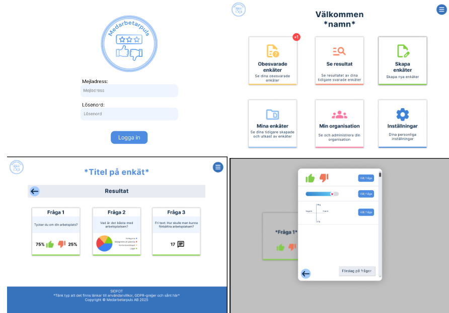

# Medarbetarpuls



## Installation & Setup

### Prerequisites

Before installing packages, ensure you have the following installed:


- **Python** (Recommended version: 3.10+)
- **Redis**

### Installation steps

1. **Create a virtual environment**

```sh
python3 -m venv venv
```

2. **Activate the virtual environment:**

```sh
source venv/bin/activate
```

2.1. **To deactivate the virtual environment:**

```sh
deactivate
```

#### **Warning: From here on the virtual environment needs to be activated!**

If the virtual environment is deactivate or the terminal is restarted the
venv needs to be activated again!

3. **Change directory to Django-project one:**

```sh
cd Medarbetarpuls
```

4. **Upgrade/install pip:**

```sh
python3 -m pip install --upgrade pip
```

5. **Install required packages:**

```sh
python3 -m pip install -r requirements.txt --quiet --no-cache-dir
```

6. **Verify installation:**

```sh
django-admin --version
```

Here a version of Django should be printed in the terminal!

### Running the server

1. **Migrate the database:**
```sh
python3 manage.py migrate
```

2. **Collect static files so they can be served:**
```sh
python3 manage.py collectstatic
```

3. Start Redis server (note that this requires sudo privileges):
```sh
sudo systemctl start redis
```

3.1. Optionally enable Redis to be started on boot:
```sh
sudo systemctl enable redis
```

#### **Warning: Redis should be configured with a separate systemd profile for security reasons**

4. **Start the Django server and Celery worker:**
```sh
python3 manage.py runserver & celery -A Medarbetarpuls worker -l info
```

**Now, you can visit the host (http://127.0.0.1:8000/ if unspecified) to see the website!**       
**To create a new organization visit https://yourhost.com/create_org (or http://127.0.0.1:8000/create_org if unspecified)** 


## Code structure and overview
The project is structured using the standard Django setup, where we have 
separate dictionaries for the frontend and backend files.    

### Frontend 
In the Django app dictionary (medarbetarapp), the dictionaries static and templates contains all 
frontend files, such as static styles, Javascript and images and all html templates. 

#### HTML templates
For every page that is displayed in the GUI there is a specific html template file that is used. There 
are also a partials dictionary inside the templates one, where partial html elements that are used to 
replace/update specific parts of the GUI are stored. 

#### Styling 
To style all webpages the specific utility styling files, located in the css dictionary inside the static one, 
are used. There is also an images dictionary that contains all images that needs to be displayed in the GUI. 

### Backend

#### Django project 
The Django project dictionary (Medarbetarpuls) contains all necessary files to configure the project, files 
such as settings.py, urls.py and celery.py. Below follows a description of relevant Django project files.  

* **Settings**(settings.py) - Contains all configured settings and also third-party dependencies
* **URLs**(urls.py) - Maps all Django app urls to the project, so all urls can be reached from the GUI
* **Celery**(celery.py) - Handles the setup of celery as an app to used in the project

#### Django apps
The backend uses a single Django app (medarbetarapp) where files such as models.py, views.py, tasks.py and 
analysis_handler.py make up the backend of the system. Below follows a description of relevant Django app files.

* **Models**(models.py) - Defines the database structure with all the data needing to be saved  
* **Views**(views.py) - Handles the logic for what the user can see and do with the GUI 
* **URLs**(urls.py) - Maps all web requests to a function in views.py
* **Tasks**(tasks.py) - Contains all functions that can be run in parallel with the rest of the system 
* **Admin**(admin.py) - Makes it possible to easily manage the database when models are registered
* **Analysis**(analysis_handler.py) - Contains all necessary functions to analyze survey answers  
